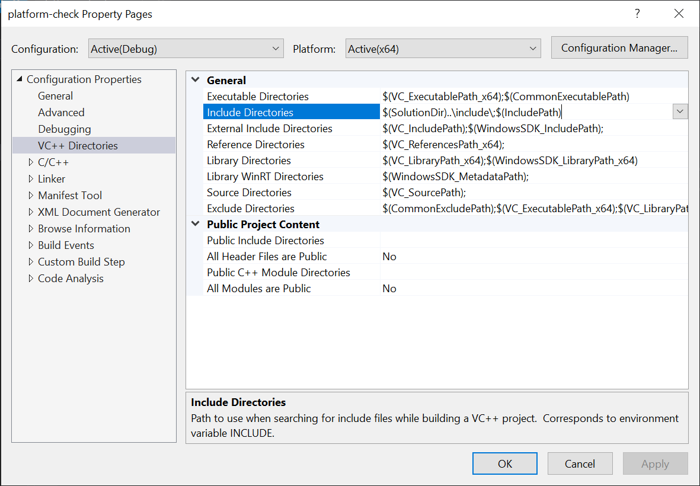

# rain

Cross-platform, self-contained, header-only C++17 libraries with utilities for

* Sockets, TCP, HTTP, SMTP, general request/response-based protocols, DNS resolution (A, AAAA, MX),
* Threadpool-based thread management,
* Command-line, string, and base 64 parsing and encode/decode,
* Basic exception management, error management, and memory leak detection,
* Knuth-Morris-Pratt (KMP) string matching and template Least-Recently-Used (LRU) cache.

This document contains summary-level information on `rain`. The changelog at `changelog.md` contains updates in each version, as well as high-level information about the codebase. Finally, low-level documentation can be found with in-code comments as well as the tests in `test/`.

## Usage

The `rain` library utilizes the C++17 standard (or newer) and any projects built with `rain` must as well.

All library code is under `include/`. Since `rain` is header-only, no specialized build options are necessary. Either copy the contents of `include/` into the directory of the source file containing `main`, or add `include/` to the include paths for the compiler.

Below are instructions for adding additional include paths.

### `g++`

`g++` uses the `-I` switch to specify additional include paths.

### Visual Studio

Within Visual Studio 2019, each project contains configuration properties accessible via a context menu on the project. Under the project’s Property Pages, the Include Directories setting under the VC++ Directories submenu specifies the include path settings to be updated.

### `cl.exe` (Visual C++ command line)

Very similar to `g++`, `cl.exe` uses the `\I` flag to specify additional include directories.

### Visual Studio Code

Visual Studio Code build tasks invoke a command-line compiler of choice. Please refer to the documentation for those compilers.

## Build

To run the tests under `test/`, one needs to invoke one of several build procedures under `build/`. By default, the target is `x64`. Depending on the platform/development environment, one or multiple of these may be available.

### `g++` (Windows WSL, MacOS, Linux)

`build/makefile` contains several functions for building:

* `all`: Build all the tests into `bin/`.
* `noinc`: Similar to `make all`, but skip incrementing the build number in `include/rain/build.hpp`.
* `run TEST=$TEST_NAME`: Builds and runs a single test with the name `$TEST_NAME`.
* `runall`:  Builds and runs all tests in `test/` consecutively.
* `clean`: Deletes the `bin/` and `obj/` intermediates directories.

Builds default to debug. Specify `RELEASE=1` to build with release optimization. Specify `INSTRUMENT=1` to build with instrumentation options.

### Visual Studio (Windows)

Each test is given its own project under the `build/rain.sln` solution for Visual Studio 2019.

All tests and new tests follow the project template specified in `build/rain.template/`. For information on developing new tests using this template, please see the ‘Development’ section later.

### `cl.exe` (Windows)

Command-line builds on Windows are supported via `cl.exe`.

Alternatively, `build/build.bat` builds with the same options as the Visual Studio build. It takes two arguments: the name of the test (e.g. `platform`), and “release” for a release build.

### Visual Studio Code (Windows, MacOS, Linux)

Visual Studio Code utilizes `build/build.bat` or `build/makefile` with two launch options: `windows-debug-x64` and `posix-debug-x64`.

An additional task `clean` is configured to remove the `bin/` and `obj/` directories.

## Development

The style guide is implicitly specified in `.clang-format`. Additionally, please place `const` specifiers after type specifiers, i.e. write `char const *tmp` instead of `const char *tmp`.

The following are additional guidelines for development in select environments.

### Visual Studio

New tests should be added to the `build/rain.sln` solution as a new project with the same name as the test. The project should inherit settings default in the `rain` project template at `build/rain.template/`.

To import the template into Visual Studio, zip the folder into `rain.zip` and copy the zip file to `%USERPROFILE%\Documents\Visual Studio 2019\Templates\ProjectTemplates\Visual C++ Project\`.

### Visual Studio Code

Recommended VSCode settings are stored in `.vscode/settings.default.json`. `.vscode/settings.json` is gitignored by default.
